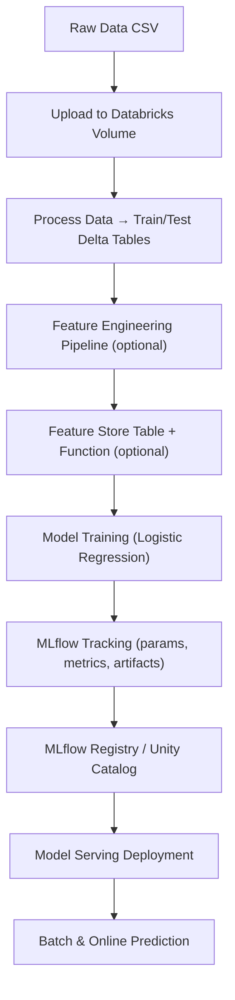

# 🏨 Hotel Reservation — End-to-End MLOps with Databricks

[](https://databricks.com)
[](#)
[](#)

## 📚 Table of Contents

* [🧠 Project Overview](#-project-overview)
* [🧰 Technology Stack](#-technology-stack)
* [⚙️ Installation & Setup](#️-installation--setup)
* [🧩 Repository Structure](#-repository-structure)
* [🚀 Key Features](#-key-features)
* [⚙️ Databricks Asset Bundle Workflow](#️-databricks-asset-bundle-workflow)
* [🧪 Development & Testing Workflow](#-development--testing-workflow)
* [🔁 Reproduce Results](#-reproduce-results)
* [🧱 Prerequisites](#-prerequisites)
* [🧾 Configuration Example](#-configuration-example)
* [📊 End-to-End Workflow](#-end-to-end-workflow)
* [📚 Documentation](#-documentation)
* [🧑‍💻 Contributing](#-contributing)
* [📜 License & Credits](#-license--credits)


## 🧠 Project Overview

An **end-to-end MLOps project** developed as part of the [Databricks Free Edition Hackathon](https://www.databricks.com/blog/databricks-free-edition-hackathon-show-world-whats-possible-data-and-ai), running from November 5 - November 14, 2025.
It automates the complete lifecycle of a **hotel reservation classification model**, from **data ingestion & preprocessing** to **model training, registration, deployment, and serving** — fully orchestrated on **Databricks Free Edition**.

This repository demonstrates:

* **Reproducible ML pipelines** using **Databricks, MLflow**, and **LogisticRegression**
* **Automated Databricks job workflows** using **Databricks Asset Bundles**
* **Multi-environment configuration** across **DEV / ACC / PRD**
* **Environment management & automation** with **Devbox**, **UV**, and **Taskfile**
* **CI/CD** using **GitHub Actions** or **GitLab CI** (builds, docs, tests)
* **Comprehensive testing** with **Pytest**, **Ruff**, and **pre-commit**
* **Documentation & Wiki integration** via **Sphinx**.

## 🧰 Technology Stack

### Core Components


[](#)
[](https://powerbi.microsoft.com)

### Databricks Components

[](#)
[](#)
[](#)
[](#)


### Development Environment


### Version Control & CI/CD


## ⚙️ Installation & Setup

### 1️⃣ Clone the Repository
```bash
git clone <your-repo-url>
cd hotel_reservation
````

### 2️⃣ Install Tooling

```bash
task install
```

### 3️⃣ Open a Devbox Shell (if needed)

```bash
devbox shell
```

### 4️⃣ Create and Sync Python Environment

```bash
task dev-install
```

### 5️⃣ Configure Environment Variables

```bash
cp .env.template .env
# → update with Databricks credentials, tokens, etc.
```

⚠️ **Security Note**: Never commit your `.env` file. Use [Databricks Secrets](https://docs.databricks.com/en/security/secrets/secrets.html) or a secure vault.


### 6️⃣ Run Demo Pipeline

```bash
task demo
```

You can verify your setup with:

```bash
task lint
task test
```

## 🧩 Repository Structure

```
.
├── CHANGELOG.md                   # Project changelog — version history and updates
├── CONTRIBUTING                   # Contribution guidelines (commits, PRs, conventions)
├── LICENCE                        # Project license and usage permissions
├── README.md                      # Main documentation file
├── Taskfile.yml                   # Task automation (install, test, lint, deploy)
├── Taskfiles.md                   # Extended task documentation and pipeline overview
│
├── app/                           # Local inference or monitoring application (Streamlit / API)
│   ├── app.py                     # Main Streamlit app for model serving
│   ├── app.yml                    # Databricks Asset Bundle configuration for app deployment
│   ├── app_monitoring.py          # Streamlit dashboard for model performance monitoring
│   ├── hotel.jpg / hotel.png      # Static images for UI display
│   └── requirements.txt           # App-specific dependencies
│
├── data/                          # Data lifecycle folders (raw → processed)
│   ├── external/                  # External datasets (APIs, external sources)
│   ├── interim/                   # Intermediate transformed data
│   ├── processed/                 # Processed data ready for ML training
│   └── raw/                       # Original raw dataset(s)
│
├── databricks.yml                 # Main Databricks Asset Bundle definition (job orchestration)
├── devbox.json                    # Devbox environment configuration (reproducible shell)
│
├── docs/                          # Sphinx documentation and technical references
│   ├── README.md                  # Secondary documentation index
│   ├── commands.rst               # CLI commands and Taskfile command reference
│   ├── references/                # Technical references (Databricks, MLflow, etc.)
│   └── reports/                   # Reports and analytics
│       └── figures/               # Generated figures and plots
│
├── models/                        # Exported models or local MLflow registry cache
│
├── notebooks/                     # Databricks notebooks for prototyping and orchestration
│   ├── process_data.py            # Data cleaning and processing
│   ├── train_register_*.py        # Model training and registration (basic/custom/FE)
│   ├── deploy_*.py                # Model deployment scripts (Databricks Serving)
│   ├── predict_*.py               # Model inference and validation
│   ├── create_monitoring.py       # Creates model monitoring pipelines
│   ├── refresh_monitoring.py      # Refreshes monitoring metrics and dashboards
│   ├── demo.py                    # End-to-end demonstration pipeline
│   └── utils/                     # Helper scripts for Databricks operations
│       ├── run_upload_data.py     # Upload dataset to Databricks Volume
│       ├── run_cleanup_mlflow_experiments.py # Clean old MLflow experiments
│       ├── run_create_mlflow_workspace.py    # Initialize MLflow workspace and structure
│       └── run_cleanup_data.py    # Clean up Databricks data volumes
│
├── project_config.yml             # Multi-environment configuration (dev / acc / prd)
├── pyproject.toml                 # Python project metadata and dependencies
│
├── resources/                     # Databricks YAML templates and job configurations
│   ├── inference.app.yml          # Model inference service deployment
│   ├── bundle_monitoring.yml      # Monitoring job bundle definition
│   ├── initial_training_*.yml     # Initial model training jobs (basic/custom)
│   ├── weekly_training_*.yml      # Weekly retraining workflows
│
├── scripts/                       # Executable Python scripts for CI/CD and bundles
│   ├── 00.process_initial_data.py # Initial dataset preparation
│   ├── 01.process_new_data.py     # Incremental data ingestion pipeline
│   ├── 02.train_register_model.py # Train and register baseline model
│   ├── 02.b.train_register_custom_model.py # Train and register tuned/custom model
│   ├── 03.deploy_model_serving.py # Deploy model to Databricks Serving
│   ├── 03.b.deploy_custom_model_serving.py # Deploy the custom model variant
│   ├── 04.post_commit_status.py   # Post-build CI validation
│   └── 05.refresh_monitor.py      # Refresh MLflow model monitoring metrics
│
├── src/                           # Main Python package source code
│   └── hotel_reservation/
│       ├── data/                  # Data ingestion, config loading, and upload helpers
│       │   ├── cleanup.py         # Data cleaning and preparation logic
│       │   ├── config_loader.py   # YAML configuration file parser
│       │   ├── databricks_utils.py# Databricks workspace interaction utilities
│       │   └── uploader.py        # Uploads raw datasets to Databricks Volumes
│       │
│       ├── feature/               # Feature engineering and transformation logic
│       │   └── data_processor.py  # Pipeline for generating ML-ready features
│       │
│       ├── model/                 # Model definition, training, and registration
│       │   ├── basic_model.py     # Baseline logistic regression model
│       │   ├── custom_model.py    # Custom model variant with hyperparameter tuning
│       │   └── feature_lookup_model.py # Model integrating with Databricks Feature Store
│       │
│       ├── serving/               # Model serving and API interface
│       │   └── model_serving.py   # Databricks Serving endpoint handler
│       │
│       ├── utils/                 # Generic utility functions and helpers
│       │   ├── config.py          # Configuration loader and management
│       │   ├── databricks_utils.py# Shared Databricks API wrappers
│       │   ├── env_loader.py      # Environment variable and .env manager
│       │   └── timer.py           # Performance and timing utilities
│       │
│       └── visualization/         # Model monitoring and visualization tools
│           └── monitoring.py      # Metrics visualization and drift monitoring
│
├── tests/                         # Full testing suite (unit / integration / functional)
│   ├── unit_test/                 # Unit tests for all modules
│   ├── integration/               # Integration tests for Databricks & MLflow
│   └── functional/                # End-to-end tests (model serving and API)
│
├── uv.lock                        # Locked dependency versions (managed by UV)
└── version.txt                    # Current project version number
```

## 🚀 Key Features

* **End-to-End ML Lifecycle:** Data upload → Feature Engineering → Training → Registry → Serving
* **Asset Bundle Deployment:** Automated workflows defined in `databricks.yml`
* **Environment-Aware Configuration:** Per-env catalog/schema setup (`dev`, `acc`, `prd`)
* **Testing:** Full unit, integration, and functional coverage using Pytest
* **Docs:** Built automatically via CI from `docs/`
* **Code Quality:** Pre-commit hooks, linting, and commit message enforcement via Commitizen
* **Business Integration**: We integrate a Power BI Dashboard that uses the results of the model prediction to demonstrate the business impact of this project in the decision making.

## ⚙️ Databricks Asset Bundle Workflow

The deployment and automation pipeline is defined in `databricks.yml`.
It orchestrates the following Databricks tasks:

1. **Preprocessing** — Runs `scripts/01.process_new_data.py`
2. **Model Training** — Runs `scripts/02.train_register_model.py`
3. **Conditional Deployment** — Deploys only if a new model version is created
4. **Serving Update** — Uses `scripts/03.deploy_model_serving.py`
5. **Post-Commit Check** — Optionally validates CI integration results

You can run the workflow directly from CLI:

```bash
databricks bundle deploy
databricks bundle run deployment --target dev
```

## 🧪 Development & Testing Workflow

| Command                        | Description                                |
| ------------------------------ | ------------------------------------------ |
| `task dev-install`             | Setup dev dependencies                     |
| `task demo`                    | Run full demo pipeline locally             |
| `task run-upload-data`         | Upload dataset to Databricks volume        |
| `task run-process-data`        | Create train/test Delta tables             |
| `task train-register-model`    | Train and register baseline model          |
| `task fe_train_register_model` | Train with Feature Store & Feature Lookup  |
| `task lint`                    | Run Ruff, formatters, and pre-commit hooks |
| `task clean`                   | Clean environment and temporary files      |
| `pytest`                       | Run all unit/integration/functional tests  |


## 🔁 Reproduce Results

1. Upload dataset:

   ```bash
   task run-upload-data
   ```
2. Train & register:

   ```bash
   task train-register-model
   ```
3. Deploy serving endpoint:

   ```bash
   task deploy-model-serving
   ```
4. Validate predictions:

   ```bash
   pytest tests/functional
   ```

## 🧱 Prerequisites

* **Required:** macOS/Linux, Python ≥3.12, Databricks workspace, `task`, `devbox`, `uv`
* **Optional:** Docker (for isolated testing), CI/CD setup with GitHub or GitLab runners

## 🧾 Configuration Example

```yaml
dev:
  catalog_name: mlops_dev
  schema_name: hotel_operation
  volume_name: data
  raw_data_file: "Hotel_Reservations.csv"
  train_table: hotel_reservations_train_set
  test_table: hotel_reservations_test_set
  feature_table_name: hotel_reservations_features
  feature_function_name: hotel_reservations_feature_fn
  experiment_name_fe: /Shared/hotel_reservations/fe_experiment
```

Switch environments easily:

```bash
task run-upload-data --branch=dev
task fe_train_register_model --branch=prd
```

## 📊 End-to-End Workflow



## 🧑‍💻 Contributing

```bash
git checkout -b feature/<your-feature>
task lint
cz commit
git push origin feature/<your-feature>
```

Then open a **Merge Request / Pull Request** via GitHub or GitLab.

Refer to the [CONTRIBUTING](CONTRIBUTING) file for full contribution guidelines.

## 📚 Documentation

* 📘 [View Wiki](https://github.com/end-to-end-mlops-databricks-4/marvelous-databricks-course-malganis35/blob/main/wiki-content/Course-Overview.md)
* 📗 [Read the Docs](https://docs.mlops.caotri.dofavier.fr/)
* 🧾 Reports: `/docs/reports/figures/`

## 📜 License & Credits

Proprietary © 2025 — *Cao Tri Do*
For **internal use only**. See the [LICENCE](LICENCE) file for details.

This repository was initiated thanks to the *Marvelous MLOps — End-to-end MLOps with Databricks: https://maven.com/marvelousmlops/mlops-with-databricks*.

**I would like to deeply thanks my 2 Course Mentors**:

- [Maria Vechtomova (@mvechtomova)](https://github.com/mvechtomova)
- [Basak Tugce Eskili (basakeskili)](https://github.com/basakeskili)
